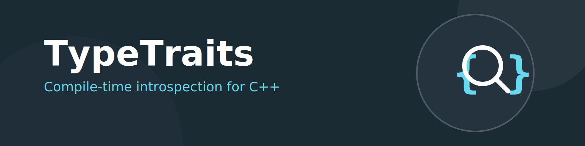

# TypeTraits

Header-only C++ type-trait helpers for compile-time introspection.

## Purpose

This repository provides reusable trait utilities to:

- detect whether operators, hashes, and member/static member functions exist with specific signatures
- classify string-like types (`std::basic_string`, `std::basic_string_view`, character pointers, and character arrays)
- reason about type compatibility at compile time (including character-type compatibility)
- support generic code paths that depend on string/character semantics

# Installation

The installation and build is tested on *ubuntu24.04 LTS*

## Dependencies

Dependencies are automatically managed by the CI/CD pipeline using CMakeCommon. For local development, the dependencies will be built and cached automatically.

## Build and Install

```bash
# Clone the repository with submodules
git clone --recursive https://github.com/kingkybel/TypeTraits.git
cd TypeTraits

# Build the project (dependencies will be built automatically)
mkdir build
cd build
cmake -Wno-dev ..
cmake --build . --parallel $(nproc)

# Install (optional)
sudo cmake --install .
```

This will install the headers from the include-folder to `/usr/local/include/dkyb` (or your specified CMAKE_INSTALL_PREFIX).

To use the headers in your code, make sure that the install prefix is in the include directories of your project.
Include the file in your code e.g:
```c++
#include <dkyb/traits.h>
```

## Usage Examples

### String-like Type Detection

The library provides traits to identify various string-like types at compile time:

```cpp
#include <dkyb/traits.h>
#include <string>
#include <string_view>
#include <iostream>

int main() {
    // Check if types are string-like
    std::cout << "std::string is string-like: " << util::is_string_v<std::string> << std::endl;
    std::cout << "std::string_view is string-like: " << util::is_string_v<std::string_view<char>> << std::endl;
    std::cout << "const char* is string-like: " << util::is_string_v<const char*> << std::endl;
    std::cout << "char[] is string-like: " << util::is_string_v<char[10]> << std::endl;
    std::cout << "int is string-like: " << util::is_string_v<int> << std::endl;
    
    return 0;
}
```

### Character Type Detection

```cpp
#include <dkyb/traits.h>
#include <iostream>

int main() {
    std::cout << "char is character: " << util::is_char_v<char> << std::endl;
    std::cout << "wchar_t is character: " << util::is_char_v<wchar_t> << std::endl;
    std::cout << "int is character: " << util::is_char_v<int> << std::endl;
    
    return 0;
}
```

### String Compatibility

Check if two string types are compatible (same character type):

```cpp
#include <dkyb/traits.h>
#include <iostream>

int main() {
    using namespace util;
    
    // Compatible strings
    std::cout << "std::string and const char* compatible: " 
              << is_compatible_string_v<std::string, const char*> << std::endl;
    
    // Incompatible strings (different char types)
    std::cout << "std::string and std::wstring compatible: " 
              << is_compatible_string_v<std::string, std::wstring> << std::endl;
    
    return 0;
}
```

### Operator Detection

Check if types support comparison operators:

```cpp
#include <dkyb/traits.h>
#include <iostream>

struct Comparable {
    bool operator==(const Comparable&) const { return true; }
    bool operator<(const Comparable&) const { return true; }
};

struct NotComparable {};

int main() {
    std::cout << "int supports ==: " << util::is_equality_comparable_v<int> << std::endl;
    std::cout << "Comparable supports ==: " << util::is_equality_comparable_v<Comparable> << std::endl;
    std::cout << "NotComparable supports ==: " << util::is_equality_comparable_v<NotComparable> << std::endl;
    
    std::cout << "int supports <: " << util::is_less_comparable_v<int> << std::endl;
    std::cout << "Comparable supports <: " << util::is_less_comparable_v<Comparable> << std::endl;
    
    return 0;
}
```

### Hash Support Detection

Check if a type has a std::hash specialization:

```cpp
#include <dkyb/traits.h>
#include <iostream>
#include <string>

struct CustomType {};

int main() {
    std::cout << "std::string has std::hash: " << util::has_std_hash_v<std::string> << std::endl;
    std::cout << "int has std::hash: " << util::has_std_hash_v<int> << std::endl;
    std::cout << "CustomType has std::hash: " << util::has_std_hash_v<CustomType> << std::endl;
    
    return 0;
}
```

### Member Function Detection

Use the provided macros to detect member functions:

```cpp
#include <dkyb/traits_static.h>
#include <iostream>

// Define traits for member functions
DEFINE_HAS_MEMBER_FUNCTION(has_fill_method, fill, bool (T::*)(void));
DEFINE_HAS_STATIC_MEMBER_FUNCTION(has_static_fill_method, fill, bool (*)(void));

struct WithFill {
    bool fill() { return true; }
};

struct WithStaticFill {
    static bool fill() { return true; }
};

struct WithoutFill {};

int main() {
    std::cout << "WithFill has fill(): " << has_fill_method_v<WithFill> << std::endl;
    std::cout << "WithStaticFill has static fill(): " << has_static_fill_method_v<WithStaticFill> << std::endl;
    std::cout << "WithoutFill has fill(): " << has_fill_method_v<WithoutFill> << std::endl;
    
    return 0;
}
```

### String Size Calculation

Get the size/length of various string-like types:

```cpp
#include <dkyb/traits.h>
#include <iostream>
#include <string>

int main() {
    std::string str = "hello";
    const char* cstr = "world";
    char arr[] = "test";
    
    std::cout << "std::string size: " << util::string_or_char_size(str) << std::endl;
    std::cout << "const char* size: " << util::string_or_char_size(cstr) << std::endl;
    std::cout << "char[] size: " << util::string_or_char_size(arr) << std::endl;
    std::cout << "char size: " << util::string_or_char_size('a') << std::endl;
    std::cout << "int size: " << util::string_or_char_size(42) << std::endl;
    
    return 0;
}
```

## Powered by
Reduce the smells, keep on top of code-quality. Sonar Qube is run on every push to the `main` branch on GitHub.

[](https://sonarcloud.io/project/overview?id=kingkybel_TypeTraits)
